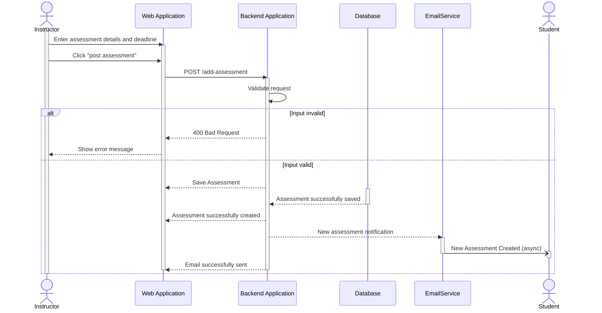

```mermaid
sequenceDiagram
    actor Instructor
    participant WA as Web Application
    participant BA as Backend Application
    participant Database
    participant EmailService
    actor Student

    activate Instructor
    Instructor->>WA: Enter assessment details and deadline
    activate WA
    Instructor->>WA: Click "post assessment"
    WA->>BA: POST /add-assessment

    activate BA
    BA->>BA: Validate request

    alt Input invalid
        BA-->>WA: 400 Bad Request
        WA-->>Instructor: Show error message
    else Input valid
        BA-->>WA: Save Assessment
        activate Database
        Database-->>BA: Assessment successfully saved
        deactivate Database

        BA-->>WA: Assessment successfully created

        BA-->>EmailService: New assessment notification
        activate EmailService
        EmailService-)Student: New Assessment Created (async)
        activate Student
        deactivate Student

        deactivate EmailService

        BA-->>WA: Email successfully sent

        deactivate BA

        deactivate WA
    end
    deactivate Instructor
```